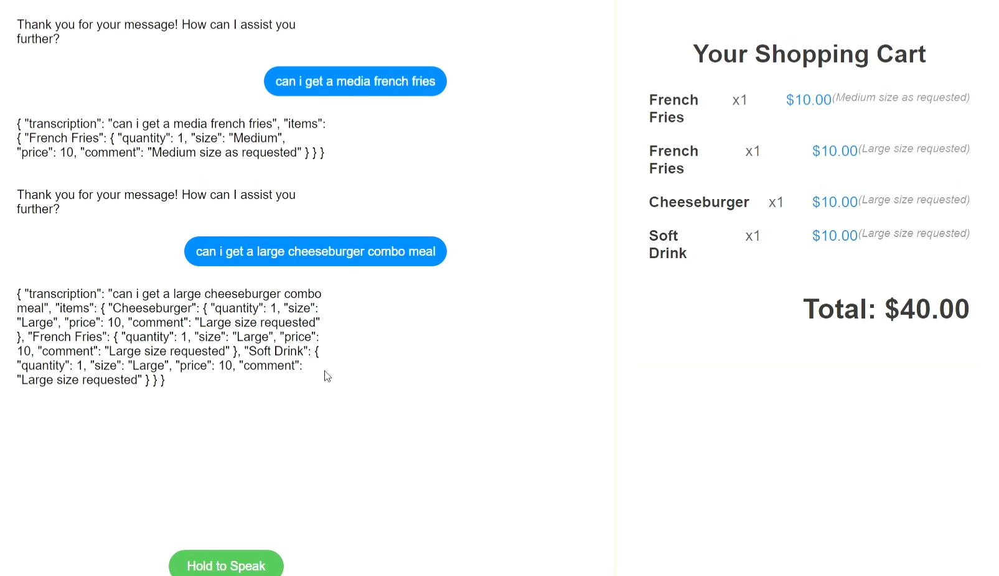
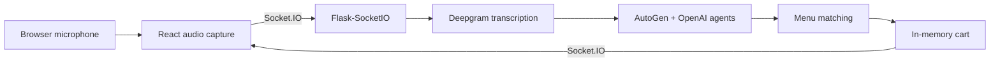

# Orderly

Orderly is a **CalHacks 11.0 proof of concept** for conversational drive-through ordering. A customer holds a button to speak; the browser streams recorded audio to a Flask-SocketIO backend, Deepgram produces a transcript, and a small group of LLM agents maps the request to menu items before updating an on-screen cart.

> **Project status:** hackathon prototype. The end-to-end demo was completed, but the code is not production hardened and depends on paid external APIs.

[](Orderly.mp4)

## Demo flow



## Features

- Push-to-talk audio capture in the browser
- Real-time client/server communication with Socket.IO
- Speech-to-text transcription through Deepgram
- Agent-based interpretation of menu requests
- Quantity adjustments, including negative quantities for removals
- Cart line items and running totals

## My contributions

My commits focused on the initial full-stack connection, Socket.IO and browser-audio debugging, the conversation UI, Deepgram integration fixes, and quantity-update behavior.

## Team

- [Jasper Liu](https://github.com/JJJasperl)
- [Jonas Li](https://github.com/LIYunzhe1408)
- [Jason Ji](https://github.com/20jij)

## Technology

- **Frontend:** React, Web Audio API, Socket.IO client
- **Backend:** Python, Flask, Flask-SocketIO
- **AI and speech:** Deepgram, OpenAI, AutoGen
- **Data:** CSV menu data and an in-memory shopping cart

## Run locally

### Prerequisites

- Node.js and npm
- Python 3
- Deepgram and OpenAI API credentials

### 1. Configure credentials

Set these environment variables in your shell. Do not commit their values.

```text
DEEPGRAM_API_KEY=your_deepgram_key
OPENAI_API_KEY=your_openai_key
```

### 2. Start the backend

```bash
cd flask-backend
python -m venv .venv
```

Activate the environment, then install and run:

```bash
pip install -r requirements.txt
python app.py
```

The Socket.IO server listens on `http://localhost:5001`.

The pinned requirements were captured on Windows and include platform-specific packages. On another operating system, remove incompatible Windows-only packages if installation fails.

### 3. Start the frontend

In a second terminal:

```bash
cd drive-through-voice-order
npm install
npm start
```

Open `http://localhost:3000`. The frontend currently expects the backend at `http://localhost:5001`.

## Prototype limitations

- The cart is stored in process memory and is reset when the server restarts.
- CORS and the Flask development server are configured for local demonstration, not deployment.
- Browser microphone behavior varies by browser and normally requires a secure context outside localhost.
- API calls may incur cost, and the external model/API versions used during the hackathon may change.
- Replace the placeholder Flask secret before adapting the code for any real deployment.

## Reuse

No open-source license has been declared for this team project. Contact the contributors before reusing the code.
